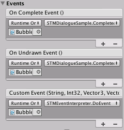

<pre>
<title>Super Text Mesh Documentation</title>
</pre>
<article class="column"><article class="banner">
 
Super Text Mesh Documentation - v1.3
</article><article class="tableofcontents"><article class="textarea">
#Table of Contents

[Features](#Features)

1. [Adding Super Text Mesh to Unity](#1)
	* [Importing Super Text Mesh into Unity](#1a)
	* [Adding Super Text Mesh to a Scene](#1b)
2. [Text Data File & Rich Text Tags](#2)
	* [Text Data](#2a)
	* [Text Data Customization](#2b)
	* [Rich Text Tags](#2c)
3. [Functions, Variables & Events](#3)
	* [Public Functions](#3a)
	* [Public Variables](#3b)
	* [UnityEvents](#3c)
4. [Shaders & Shadows](#4)
	* [Changing Shaders & Included Shaders](#4a)
	* [Clues for Writing Custom Shaders](#4b)
	* [Enabling Shadowcasting](#4c)
	* [Outlines and Dropshadows](#4d)
5. [Utilities](#5)
	* [Curve Generator](#5a)

[Notes](#Notes)
[ChangeLog](#ChangeLog)
[Credits](#Credits)
</article></article><article class="textarea">

***

#Features
* Super Text Mesh is a text-rendering asset for Unity, with similar implementation to Unity's default text mesh. It's primary focus is accessibility towards developers and players, and is made to work easily with in-game dialogue.
* Size and quality (font point size) are independent of each other. You can adjust the quality of a character without changing its size in-editor. This makes it much easier to get text to be the right size while looking sharp.
* Animated text effects! Text can move in completely customizable wave and jitter patterns!
* Text color can be set from a hex code, or from a definable preset.
* Moving gradients and textures can also be used as a text color!
* Lots of customization, kept simple. All customizations are kept on one file that's shared across all text meshes in your project. You can even keep these settings for a different project!
* Text wrap is shown with a visible bounding box.
* Built for dialogue! There are several ways to tweak sound effects, writing animations, and more. You can even expand on this with custom events!
* Also works with Unity UI!

***

#1. Adding Super Text Mesh to Unity

##a. Importing Super Text Mesh into Unity

<article class="rightbox">
  
Recommended minimum install.
</article>

To import Super Text Mesh into your project, either drag in the .unitypackage file, or get it from the asset store window.

###Imported folders, what they do, and if you need to import them or not, alphabetically:

* __"Documentation"__ contains these docs! You don't need to import them, but you probably should!
* __"FungusSupport.unitypackage"__ only needs to be imported if you use Fungus and want to use the included custom actions. You'll have to open this package after importing it.
* __"PlaymakerActions.unitypackage"__ only needs to be imported if you use Playmaker and want to use included custom actions. You'll have to open this package after importing it.
* __"Prefabs"__ contains prefabs to be instantiated by Super Text Mesh, if you add it to a scene through the "GameObject" menu. If you only plan to add Super Text Mesh to a scene as a component, you don't need this folder.
* __"Resources"__ contains the "TextData" file. Required.
* __"Sample"__ has resources for the example scene, and default media used by TextData. If you don't need to see the example scene, you don't need this folder.
* __"Scripts"__ contains the actual code for Super Text Mesh and its icons. Required.
* __"Shaders"__ contains different default shaders for Super Text Mesh. The "Unlit" shader is required, as it's the default and an error will be returned if this shader can't be found. The rest don't have to be imported.
* __"Utility"__ contains a script that generates AnimationCurves that you can save, and then load into curve fields. Not required.

##b. Adding Super Text Mesh to a Scene

<article class="rightbox">
  
Adding as a new Game Object.
</article>

To add it as a new GameObject, you can also go "GameObject > 3D Object > Super 3D Text", to create a new Text Mesh object. This option may require a reset of Unity to appear, initially.
"GameObject > UI > Super Text" is the path for adding a new UI Text object. Please do not add Super Text Mesh to your game by dragging in the prefabs from the "prefabs" folder. Those only exist so adding it from the GameObject menu can work!

To add Super Text Mesh to an existing object in your project, you can select "Add Component" on an existing GameObject and find it under "Mesh > Super Text Mesh". Even when adding it as a UI element, you can add it this way, as long as the object you're adding it to is already the child of a canvas (if it has a RectTransform).

***

#2. Text Data File & Rich Text Tags

##a. Text Data

<article class="rightbox">
  
The inspector window.
</article>

In "Assets > Clavian > SuperTextMesh > Resources", you can find a file named "TextData". This file is used to change the presets of all text meshes in your project. __Instead of navigating folders each time to edit this, you can click on the "[T]" icon in any Super Text Mesh's inspector to get to TextData quickly!__

This file allows customization of Super Text Mesh's rich text tags. For example, you can define a color named "1" to be called with the tag ``<c=1>``, or a text delay to be called using ``<d=myDelay>`` so you wouldn't have to type the same number over and over to call the same effect.

##b. Text Data Customization
Waves, Jitters, and Delays all have customizable default settings. When you go to edit them, you'll notice a setting named "default". This will be the setting called by the basic version of this tag. (``<w>``, ``<j>``, ``<d>``.) These can be changed to whatever settings you want.
In other words, using the ``<w>`` tag would be the same as calling ``<w=default>``.

Other aspects of Super Text Mesh, like draw animations, automatic voice clips, and master switches are also controlled with the text data file.

* ###Effects
list generic tags and alignment, too
	* ####Waves [``<w>`` / ``<w=name>``]
		<article class="rightbox">
		  
		Editing a wave.
		</article>
		To add a new wave, just increase the array size, and you can start editing it. You can also right click an existing array element and duplicate it!
		* __"Animate From Time Drawn"__ makes it so the animation of this wave is based on when a letter gets read by a text mesh. Using this, you can have waves that "cool down" over time by making their curves not loop, for example.
		* __"Main"__ is the controls for a specific letter in the wave.
			"Curve X/Y/Z" is how the wave will move on the X/Y/Z axises.
			"Offset" is a value from 0 to 1, representing the point on the curve where the animation starts.
			* __"Speed"__ is how fast the wave will play, multiplied by Time.time.
			* __"Strength"__ is how far the wave will move letters away from their centers.
			* __"Density"__ is how tight/loose the wave will be.
			All 3 of these aspects can be controlled inarticleidually on all 3 axises, and can also be negative.
		* __"Individual Vertex"__ determines if the four below values are active or not.
		* __"Top Left/Top Right/Bottom Left/Bottom Right"__ are all similar to "Main", but they let you assign a wave to each corner of a letter's mesh. You can do some pretty crazy effects with this, such as the "seasick" wave example.

	* ####Jitters [``<j>`` / ``<j=name>``]
		* __"Amount"__ is the max distance that letters will jitter.
		* __"Perlin"__ decides if the jitter will use perlin noise or not.
		* __"Perlin Time Multiplier"__ decides the speed of the jitter, if perlin mode is on.
		* __"Distance"__ can be used to change how far out the jitter will go on average. A linear curve is the default.
		* __"Distance Over Time"__ will be how far the jitter will reach, after being drawn. It should just be a horizontal line, if you want it to be permenant.
		* __"Distance Over Time Scale"__ is a multipler of the above curve.

	* ####Draw Animations
		Draw animations aren't called through tags, but instead a string field on text meshes that have a read delay. You can define new draw animations here.
		* __"Anim Time"__ is how long the animation will last.
		* __"Anim Curve"__ is the curve the animation will take.
		* __"Start Scale"__ is a multiple of the size of a letter, from its center. When it starts drawing out, the letter will be at this scale. ((1,1,1) means it won't change in scale, (0,0,0) means it will start invisible)
		* __"Start Offset"__ is, relative from the center of a letter, where it will be at the start of the draw animation. For instance, (-1,0,0) would start the letter a bit to the left.
		* __"Fade Time"__ is how long the letter will take to fade in. If set to 0, it'll just appear.
		* __"Fade Curve"__ is the curve the fade will take.
		* __"Start Color"__ is the initial color of the mesh. Should be left at (0,0,0,0) if you dont want to do something like the "Fill" animation.

* ###Text Color
	* ####Colors [``<c>`` / ``<c=name>``]
		Define colours by name to be called by the ``<c=name>`` tag.

	* ####Gradients [``<c>`` / ``<c=name>``]
		Define a gradient to be called by the ``<c=name>`` tag.
		* __"Gradient"__ is defined using Unity's gradient editor.
		* __"Gradient Spread"__ is how far the gradient stretches over the text mesh.
		* __"Scroll Speed"__ is how fast the gradient moves. Can be set to 0 to not animate, or negative to scroll in reverse. If set to 0, this skips redrawing the mesh every frame.
		* __"Direction"__ is the gradient's direction. Horizontal and Vertical are the only options.
		* __"Smooth Gradient"__, if unchecked will make it so only one color will be present on each letter. All four vertices on a letter will have the same color set for them.

	* ####Textures [``<c>`` / ``<c=name>``]
		Define a texture to color text with. Also called with the ``<c=name>`` tag.
		* __"Texture"__ is the texture to be used. Make SURE the texture you use is set to "Repeat", not "Clamp"!!
		* __"Relative to Letter"__ determines if the texture will be relative to each individual letter, or not.
		* __"Scale with Text"__ makes it so your texture's size stays locked to the text's size, or not.
		* __"Tiling"__ is how big the texture will be, mapped to the text.
		* __"Offset"__ is an additional offset for the texture.
		* __"Scroll Speed"__ is how fast the texture will move. Can be set to 0 to be static. (This will skip redrawing the mesh every frame)

* ###Inline
	* ####Delays [``<d>`` / ``<d=name>``]
		Delays can be defined here, to be called back quickly using tags instead of numbers.

	* ####Voices [``<v>`` / ``<v=name>``]
		Define "voices" to be called by ``<v=name>``.
		These are just different presets for STM that can be changed on the fly.
		Make sure to check the "Use..." boolean above the new value if you want it to actually override whatever is on STM.

	* ####Fonts [``<f>`` / ``<f=name>``]
		You can define a font to be called with the ``<f=name>`` tag, here. At the moment, changing font effects the whole mesh, so this is mainly here so you don't have to use code to change the font of a mesh.

* ###Automatic
	* ####Auto Delays
		Automatic delays that happen after specific characters can be defined, here. They only occur if the following character in a string is a space, tab or line break.
		* __"Character"__ is the character this delay will be looking for.
		* __"Count"__ is the delay amount, which is a multiple of a text mesh's reading speed. (A count of 2 on a Text Mesh where delay is set to 0.1 will result in a delay of 0.2 seconds.)

		An auto delay will be inserted _after_ its character is read out.

	* ####Clips (Audio Clips)
		Certain audio clips can be defined to play for specific characters, here.
		If "Clip" is undefined, a sound will NOT be played for this character. This is good for spaces, line breaks, and tabs, all of which are defined for this by default.
		This feature could be used to set up a typewriter, so you can have it make the distinctive "ding" sound, every time a line break is read out.

* ###Master
	* Disable Animated Text
		For accessibility, you can use this bool to easily enable/disable ALL animated text effects in your game. To call it with code, you can use "``SuperTextMesh.data.disableAnimatedText``".

##c. Rich Text Tags

<article class="rightbox">
  
Editing a wave.
</article>

These tags can be used mid-string to change aspects of the text! Any tag that has "name" on it like "``<c=name>``" can be modified with the [Text Data file](#2b). All tags can be closed with a tag like "``</c>``", for example.

* __Color__ [``<c>`` / ``<c=name>`` / ``<c=hexcode>`` / ``<c=``[DefaultColorName](https://docs.unity3d.com/ScriptReference/Color.html)``>``] Change color/gradient/texture of text. Hex code is without the # symbol, and supports alpha.
* __Relative Size__ [``<s=float>``] Change size of text, relative to the default size.
* __Size__ [``<size=float>``] Set the exact size of text.
* __Delay__ [``<d>`` / ``<d=int>`` / ``<d=int>``] For reading out text, insert a delay that's worth the time it takes to read out x amount of characters.
* __Timing__ [``<t=float>``] Set the exact time the following letters will read from. Good for syncing up text.
* __Event__ [``<e=string>``] Will invoke a [custom event](#3c) when the text mesh reads it.
* __Repeating Event__ [``<e2=string>``] Will do the same as the normal event tag, but repeat for each letter until cancelled with ``</e2>``.
* __Voice__ [``<v=name>``] use a custom voice, defined in Text Data.
* __Font__ [``<f=name>``] Use a font, defined in Text Data.
* __Bold__ [``<b>``] Set text to be bold. Can stack with italic.
* __Italic__ [``<i>``] Set text to be italic. Can stack with bold.
* __Wave__ [``<w>`` / ``<w=name>``] Use a wave from the Text Data file.
* __Jitter__ [``<j>`` / ``<j=name>``] use a jitter fromt he Text Data file.
* __Alignment Tags__ [``<a=alignment>``] These will set text alignment, mid-string.  
	* __Left__ [``<a=left>``] Align text left.
	* __Right__ [``<a=right>``] Align text right.
	* __Center__ [``<a=center>`` / ``<a=centre>``] Align text to be centred.
	* __Justified__ [``<a=just>`` / ``<a=justify>`` / ``<a=justified>``] Justify text, paragraph-style.
	* __Force Justified__ [``<a=just2>`` / ``<a=justify2>`` / ``<a=justified2>``] Force text to be justified, even if it breaks traditional paragraph rules.
* __Line Break__ [`` `` / <code>\\n</code>] Good for inserting line breaks on single-line text entry fields.

If you want to put a tag like ``<b>`` directly into a string and have it be shown, even with rich text enabled, you can type ``<\\b>`` to do this.

***

#3. Functions, Variables & Events

##a. Public Functions

These functions can be called with code, and are most useful for dialogue managers:

* ###void SuperTextMesh.Rebuild()
	Call this to update the mesh's text. This will also cause it to read out again, if the read delay is above 0.

* ###void SuperTextMesh.Read()
	You can use this to have text get re-read without rebuilding the mesh.

* ###void SuperTextMesh.SpeedRead()
	Tells the text mesh to switch to its faster reading speed.

* ###void SuperTextMesh.RegularRead()
	Tells the text mesh to return to its regular reading speed.

* ###void SkipToEnd()
	Makes the mesh finish drawing immediately, calling all events that haven't been read yet.

* ###void SuperTextMesh.Append(string)
	Add to the end of the current text mesh string, and begin reading from this point.

* ###void UnRead()
	Tell the mesh to play its "undrawing animation". Other aliases for this function are "Unread()", "UnDraw()", and "Undraw()". After the animation finishes, the mesh won't update until Rebuild() is called again.

##b. Public Variables

All public variables can be changed with code, if needed.

###Text

* ###string SuperTextMesh.Text
	Same as SuperTextMesh.text, but Rebuild() will be called automatically upon setting. Thanks, accessors!

* ###string SuperTextMesh.text
	This is the text stored within the text mesh. The text mesh will not display it until you call Rebuild().

* ###[READ ONLY] string SuperTextMesh.drawText
	Text that the mesh will display. So this is the same as SuperTextMesh.text, but after being processed as rich text! If rich text is turned off, this will be the same as SuperTextMesh.text. This string will not include automatically-inserted hypens and line breaks.

* ###[READ ONLY] string SuperTextMesh.hyphenedText
	Text that the mesh will display, including characters that may have been added.

* ###[READ ONLY] bool SuperTextMesh.reading
	This bool returns true if the text mesh is currently reading out text. Returns false when the mesh has finished, or if the mesh has a read delay of 0.

* ###[READ ONLY] bool SuperTextMesh.unreading
	This bool returns true if the text mesh is currently playing its unreading animation.

###Appearance

* ###Font SuperTextMesh.font
	The font to be used by the text mesh.

* ###Color32 SuperTextMesh.color
	Default color used by this text mesh.

* ###float SuperTextMesh.size
	Size of this text in local space. For UI elements, this is the size in screen space.

* ###FontStyle SuperTextMesh.style
	Default font style for the text mesh.

	* __FontStyle.Normal__
	* __FontStyle.Bold__
	* __FontStyle.Italic__
	* __FontStyle.BoldAndItalic__

* ###bool SuperTextMesh.richText
	If this text mesh responds to rich text tags or not.

* ###int SuperTextMesh.quality
	This is a font's point size.

* ###FilterMode SuperTextMesh.filterMode  
	Filter mode to be used by the text mesh.  
	* __FilterMode.Point__  
		Texture pixels become blocky up close. Good for pixel fonts.  
	* __FilterMode.Bilinear__  
		Texture samples are averaged, looks smoother.  
	* __FilterMode.Trilinear__  
		Texture samples are averaged, and blended between mipmap levels.  

* ###Shader SuperTextMesh.shader;
	The [shader](#4) being used by this mesh.

###Shader

<article class="rightbox">
  
Shader controls.
</article>

* ###Color32 SuperTextMesh.shadowColor
	If the current shader has a shadow, this controls it's color.

* ###float SuperTextMesh.shadowDistance
	If the current shader has a shadow, this controls it's distance.

* ###float SuperTextMesh.shadowAngle [Range(0f,360f)]
	If the current shader has a shadow, this controls it's angle.

* ###Color32 SuperTextMesh.outlineColor
	If the current shader has an outline, this controls it's color.

* ###float SuperTextMesh.outlineWidth
	If the current shader has an outline, this controls it's width.

* ###float SuperTextMesh.shaderBlend [Range(0f,1f)]
	If the current shader is for an SDF font, this controls it's blending.

###Position

* ###Vector3 SuperTextMesh.baseOffset
	Additional offset for the mesh from the anchor point. For UI mode, you probably only want to use the left-anchored ones.

* ###TextAnchor SuperTextMesh.anchor
	Anchor point of the text box.
	* __TextAnchor.UpperLeft__
	* __TextAnchor.UpperCenter__
	* __TextAnchor.UpperRight__
	* __TextAnchor.MiddleLeft__
	* __TextAnchor.MiddleCenter__
	* __TextAnchor.MiddleRight__
	* __TextAnchor.LowerLeft__
	* __TextAnchor.LowerCenter__
	* __TextAnchor.LowerRight__

* ###SuperTextMesh.Alignment SuperTextMesh.alignment
	Decides text alignment.
	* __SuperTextMesh.Alignment.Left__
	* __SuperTextMesh.Alignment.Center__
	* __SuperTextMesh.Alignment.Right__
	* __SuperTextMesh.Alignment.Justified__
	* __SuperTextMesh.Alignment.ForceJustified__

* ###float SuperTextMesh.lineSpacing
	The space between rows of text. 1 is the default.

* ###float SuperTextMesh.characterSpacing
	Extra horizontal space between characters. Default is 0.

* ###float SuperTextMesh.tabSize
	The width that a tab should take up. Default is 4.

* ###float SuperTextMesh.autoWrap
	For non-UI, text will wrap after it goes past this point. Wrapping is disabled if this is set to 0.

* ###bool SuperTextMesh.wrapText
	For UI elements. If true, text will wrap at the bounds of the UI box.

* ###bool SuperTextMesh.breakText
	For UI elements, if text that flows over the bounding box will be broken to fit or not.

* ###bool SuperTextMesh.insertHyphens
	If true, if text exceeds the bounds, and there isn't a previous space to insert a line break, a hyphen will be inserted, and the word will be split. If false, long words may flow over the bounds.

### Timing

* ###bool SuperTextMesh.ignoreTimeScale
	If set to true, this text mesh will not be effected by time scale in any way.

* ###bool SuperTextMesh.disableAnimatedText
	Disable all animated effects for this text mesh. A master toggle for all text meshes can be found in [Text Data](#2b).

* ###float SuperTextMesh.readDelay
	The delay between letters when text is being read out. Reading disabled if set to 0.

* ###SuperTextMesh.DrawOrder drawOrder
	What order the text will draw in.  
	* __SuperTextMesh.DrawOrder.LeftToRight__  
		Default draw order.  
	* __SuperTextMesh.DrawOrder.AllAtOnce__  
		All letters will draw at once, ignoring read delay.  
	* __SuperTextMesh.DrawOrder.OneWordAtATime__  
		Read delay will only apply at spaces, tabs, line breaks, and hyphens.  
	* __SuperTextMesh.DrawOrder.Random__  
		Read delay will become the total time to read out the mesh. Letters will draw at a random point.  
	* __SuperTextMesh.DrawOrder.RightToLeft__  
		For right to left scripts.  
	* __SuperTextMesh.DrawOrder.ReverseLTR__  
		Left to Right, but starting at the end and going backwards.  

* ###string SuperTextMesh.drawAnimName
	The name of the draw animation that will be used for this mesh. Can be defined in [TextData](#2b). Case-sensitive.

###Functionality

* ###float SuperTextMesh.speedReadScale
	Multiple of timeScale for when SpeedRead() is active.

* ###float SuperTextMesh.unreadDelay
	The delay between letters for when text is unreading.

* ###SuperTextMesh.DrawOrder undrawOrder
	What order the text will undraw in. Same options as drawOrder.

* ###string SuperTextMesh.undrawAnimName
	The name of the draw animation that will be used for undrawing on this mesh. Can be defined in [TextData](#2b). Case-sensitive.

###Audio

* ###AudioSource SuperTextMesh.audioSource
	The audio source to be used by this text mesh. Must be defined to use audio.

* ###AudioClip[] SuperTextMesh.audioClips
	Audio clips to be used while reading out text. Only a single clip is needed, but if there's multiple, a random sound clip will be chosen from the array.

* ###bool SuperTextMesh.stopPreviousSound
	If set to true, whenever a new letter is read, it'll play a new sound and stop the old one.
	If set to false, new letters will not override old ones, it'll wait for the clip to end before playing a new sound.

* ###SuperTextMesh.PitchMode SuperTextMesh.pitchMode
	When reading out text, how the pitch of the sounds will be effected.

	* __SuperTextMesh.PitchMode.Normal__  
		No additional effects.  
	* __SuperTextMesh.PitchMode.Single__  
		Override the pitch of the sound clip(s) directly.  
	* __SuperTextMesh.PitchMode.Random__  
		For each letter, the pitch will be randomly chosen between two values.  
	* __SuperTextMesh.PitchMode.Perlin__  
		For each letter, the pitch will be randomly chosen between two values using perlin noise. Results in a smoother, more dialogue-like sound.  

* ### float SuperTextMesh.overridePitch [Range(0f,3f)]
	If the pitchMode is set to "Single", this will be the new pitch used.

* ### float SuperTextMesh.minPitch [Range(0f,3f)]
	If the pitchMode is set to "Random" or "Perlin", this will be the minimum random pitch.

* ### float SuperTextMesh.maxPitch [Range(0f,3f)]
	If the pitchMode is set to "Random" or "Perlin", this will be the maximum random pitch.

* ### float SuperTextMesh.perlinPitchMulti
	If the pitchMode is set to "Perlin", this will control how quickly the perlin noise value changes.

* ### float SuperTextMesh.speedReadPitch
	When speedReading, this value will be ADDED to the pitch.

###Extra Stuff

* ###[EDITOR ONLY] bool SuperTextMesh.debugMode
	If true, in the Unity editor, the Mesh Renderer and Mesh Filter components will become visible, along with any materials.

* ###[READ ONLY] int SuperTextMesh.latestNumber
	As the mesh is reading out, this will be the index of the last number read this frame. You can use SuperTextMesh.hyphenedText[latestNumber] to get the latest character drawn on any frame.

* ###[READ ONLY] float SuperTextMesh.totalReadTime
	The total amount of time it will take the mesh to read out text, including animations.

* ###[READ ONLY] float SuperTextMesh.totalUnreadTime
	The total amount of time it will take the mesh to unread text, including animations.

* ###[READ ONLY] Vector3 SuperTextMesh.topLeftBounds
	For non-UI text, The top-left bounds of the mesh, in world space.

* ###[READ ONLY] Vector3 SuperTextMesh.bottomRightBounds
	For non-UI text, The bottom-right bounds of the mesh, in world space.

In the sample project, there's a simple dialogue manager script that shows off how to use some of these functions and variables.

##c. UnityEvents

<article class="rightbox">
  
Events from the sample scene.
</article>

Unity Events call a list of component methods via the Unity Event System.

You can tell a function to be called when a certain event happens, by dragging in the GameObject & function in the Unity editor.
	
###On Complete Event ()
Invoked when a text mesh is finished writing out text.
Note: Only appears in the editor when Read Delay is greater than 0.

###On Undrawn Event ()
Invoked when a text mesh finishes its undrawing animation.

###Custom Event (string, int, Vector3, Vector3)
Invoked with the event tag (``<e=myString>`` / ``<e2=myString>``). Passes an argument that has a string, int, a Vector3, and another Vector3. The string is the "tag" written with the event. ("myString", in this case) The int is the index of the event in the string. The first Vector3 is the center of the letter in world space. The second Vector3 is the world position of the letter's bottom-left corner.

So, using the tag (``<e=helloWorld>``) mid-string could be used to invoke a function like this:  
<code>
void MyFunction(string myString, int letterIndex, Vector3 letterMiddle, Vector3 letterCorner){  
&nbsp;&nbsp;&nbsp;&nbsp;Debug.Log(myString); //prints "helloWorld"  
&nbsp;&nbsp;&nbsp;&nbsp;Debug.Log(letterIndex); //prints index of letter event was attached to  
&nbsp;&nbsp;&nbsp;&nbsp;Debug.Log(letterMiddle); //prints world position of letter  
}  
</code>

Check out "STMEventInterpreter" in the "Sample" folder, for an example of how to use this. The "TextMeshExample" scene has a few examples that use this.

###Vertex Mod (Vector3[], Vector3[], Vector3[])

<article class="rightbox">
  
Vertex Mod in action.
</article>

Not a typical event like the rest, this event is used to modify the vertices of an entire mesh. To use it, under the "Position" foldout enable "modify vertices" and the event dialogue will appear. The kind of event you'll want to call would be laid out like this:  

<code>
void ChangeVertices (Vector3[] verts, Vector3[] middles, Vector3[] positions){  
&nbsp;&nbsp;&nbsp;&nbsp;for(int i = 0; i < allMeshVertices.Length / 4; i++){  
&nbsp;&nbsp;&nbsp;&nbsp;&nbsp;&nbsp;&nbsp;&nbsp;//change a letter's verts:  
&nbsp;&nbsp;&nbsp;&nbsp;&nbsp;&nbsp;&nbsp;&nbsp;verts[4 * i + 0] += Vector3.right;  
&nbsp;&nbsp;&nbsp;&nbsp;&nbsp;&nbsp;&nbsp;&nbsp;verts[4 * i + 1] += Vector3.right;  
&nbsp;&nbsp;&nbsp;&nbsp;&nbsp;&nbsp;&nbsp;&nbsp;verts[4 * i + 2] += Vector3.right;  
&nbsp;&nbsp;&nbsp;&nbsp;&nbsp;&nbsp;&nbsp;&nbsp;verts[4 * i + 3] += Vector3.right;  
&nbsp;&nbsp;&nbsp;&nbsp;&nbsp;&nbsp;&nbsp;&nbsp;//move all to the right
&nbsp;&nbsp;&nbsp;&nbsp;&nbsp;&nbsp;&nbsp;&nbsp;Debug.Log(middles[i]); //middle of this letter  
&nbsp;&nbsp;&nbsp;&nbsp;&nbsp;&nbsp;&nbsp;&nbsp;Debug.Log(positions[i]); //position of this letter  
&nbsp;&nbsp;&nbsp;&nbsp;}  
}  
</code>

An included example script named "STMVertexMod" shows a few basic modifications you can do to a text mesh. (In the sample scene, look for an object named "CurvedTextSample" to see it in action)

Make sure when adding a new event to select "Editor and Runtime" from the event dropdown so you can see changes made in-editor.

***

#4. Shaders & Shadows

##a. Changing Shaders & Included Shaders
You can drag a new shader onto the "text shader" area to change that. The included shaders are the only ones supported, currently. You can find them in "Assets > Clavian > SuperTextMesh > Shaders".

* __"Unlit"__ is the default shader. It's an unlit shader, which means light sources don't affect it.  
* __"Cull Back Unlit"__ is just like "Unlit", but the back side of it doesn't show.  
* __"Ontop Unlit"__ always draws text on top, like Unity's default text mesh.  
  
* __"Lambert"__ will respond to light sources using the Lambert light model.  
* __"Standard"__ will respond to light sources using Unity's Standard shader.  
  
* __"Unlit Dropshadow"__ is the default shader, but with a drop shadow. [How to configure shadow.](#4d).  
* __"Unlit Outline"__ is the default shader, but with an outline. [How to configure outline.](#4d).  
* __"Unlit DropshadowAndOutline"__ is a combination of the previous two shaders.  
  
* __"UI"__ is the default shader for a UI text mesh.  
* __"UI Masked"__ is a mask shader for UI text, works with UI's Mask component.  
* __"UI Dropshadow"__ works like Unlit Dropshadow, but for UI elements.  
* __"UI Outline"__ works like Unlit Outline, but for UI elements.  
  
* __"SDF Unlit Outline"__ is a version of the default shader meant for [SDF fonts](#4d).  

##b. Clues for Writing Custom Shaders
* "_Cutoff" should probably be left at 0.0001. This value is necceary for shadows to be cast.
* The "#pragma" line must contain "alphatest:_Cutoff", or just "alpha" if you don't want to have shadows on your shader. For shadows, you need to add the text "addshadow". Finally, "noforwardadd" will generally make the shader look the way you want, color-wise.
* Super Text Mesh uses vertex colors, yet needs to use a surface shader in order to connect everything up properly with text textures (whew!). You can see this in the "struct Input" part of the code! 
* "TEXCOORD0" connects to a mesh's uv property, and "TEXCOORD1" connects to a mesh's uv2 property. "COLOR" gets the color of a given vertex.
* "surface.Albedo" is used in shaders where light should effect text, "surface.Emission" is used for unlit shaders.
* IN.color.rgb gets the vertex color from within surf.
* For the dropshadow & outline functions, he displacement is called from within "vert".

##c. Enabling Shadowcasting

To toggle Super Text Mesh's shadow casting, check the "debug mode" tick at the bottom of a Super Text Mesh component. This will make it's Mesh Renderer component visible. From there, you can change the "Cast Shadows" variable!

##d. Outlines and Dropshadows

To use outlines or drop shadows, drag the "Unlit Dropshadow", "Unlit Outline", or "Unlit DropshadowAndOutline" shaders from the "Shaders" folder into the "shader" varaible on Super Text Mesh. After this, an additional header labelled "Shader" will appear in the inspector. You can use this to set how the dropshadow and outline look!

To use the "SDF Unlit Outline" shader, you will first have to convert an existing font to an SDF font, using an external SDF texture generator. To do this, you will first have to get a font you want to use, then select a large enough "size" for the font in the inspector, and what characters to use. Next, click the gear in the top-right of the inspector and select "Create Editable Font". This will create a version of the font that's split into 3 parts: The Font file, a Material, and a Texture. You will have to run the texture through an external SDF generator, and then the font is ready to use with this shader. Just drag the Font file into Super Text Mesh and select the "SDF Unlit Outline" shader. The outline width and color can be changed just like the shaders above.

***

#5. Utilities

##a. Curve Generator

<article class="rightbox">
  
The "New" button in the curve dialogue.
</article>

Within "Assets > Clavian > SuperTextMesh > Utility", you'll find a script named "STMCurveGenerator". This script is meant to generate curves that are pretty common for waves. To use it, drag it onto any Game Object in your project, then click on one of the curves to open up the curve editor. From there, you can click the gear in the bottom left to save the curve into Unity as a preset! Then you can use it again for other curve fields, like the ones on waves and jitters.

***

#Notes
* "Quality" means font point size. When you change this value, it adds characters to the text texture. 
* For UI text, set size to be the same value as quality to get quality that matches screen size.
* Texture effects don't work on UI text! Right now I'm not sure if this is due to an oversight with Unity's CanvasRenderer component, a bug with it, or a mistake in coding on my end. There's just not enough documentation on it, yet. I will be updating the asset as soon as I can get it working, but until then, it works fine on the text mesh!
* Unity's built-in UI effects like outline and drop shadow are not supported. The built-in shaders should be used, instead.
* Tabbing out of the Unity editor and back in might cause a text mesh to redraw. This does not happen in builds. To disable this in the editor, go into Preferences, and turn "Auto Refresh" off! (Thanks, drak!)

##Known Bugs
* Occasionally, text will display the entire text atlas until Rebuild() is called another time. This seems to happen most frequently in builds, so more research is needed.
* Sometimes, text will also be given a strange offset. (Usually upwards, but it's happened to the right, too.) Seems to be linked to the above bug, currently working on pinning these two down.
* Right to Left draw order gets the timing for some animations incorrect.

##Planned Features / To Do List:
* Inline images. Same issue as texture effects not working on UI text mentioned above. Animation support for this too, hopefully. (Look into ditching canvas renderer if this bug persists.)
* Animated textures because why not. (Will be offset-based.)
* Proper pixel snap for UI text.
* Option for waves and effects to be applied by default?
* Optimise text reading even further! Right now it lerps between a "starting" mesh and an "ending" mesh as it draws, but has to constantly update the end mesh, in case it has waves. I think that this should just calculate waves itself? Similar to what happens under Update() with animating text. Also, only needs to loop over specific characters.
* Maybe a way to do clickable text that invokes a UnityEvent? Could work with a mesh collider & RaycastHit.triangleIndex.
* Review Japanese & Chinese text. Line breaks maybe occurring at bad spots. (Leaving periods the first character on a row, etc)
* UI text should automatically be added to canvas, like other canvas elements.
* A tag that lets you change shaders mid-string, like how ``<c=fire>`` works.
* Further loop optimization. Less calls to r.sharedMaterials, maybe? Store sharedMaterials somewhere else? Some things that doesn't look like they should cause garbage are, in the deep profiler. The bytes don't add up, either. Either way, only setting vertices that need to be set is good.
* Support for fonts that have letters that join together, like Arabic.
* Additional tags like ``<size>``, for ``<readDelay>``, ``<fastDelay>``, ``<drawAnim=string>``, ``<drawOrder>``, ``<unreadDelay>``, ``<undrawAnim>``, and ``<undrawOrder>``.
* Backspacing.

***

#ChangeLog
###v1.1
* Fixed a stall related to reading out text. Info will always be shorter or equal to the hyphened letter count.
* Vertexes can be controlled inarticleidually on waves, now.
* Added hard gradients.
* Autowrap can happen at a hyphen, now.
* Tabs count as space properly.

###v1.1.1
* Autowrap bounds scale & rotate properly with the mesh now.
* Added an accessor so that you can change text and call rebuild at once.

###v1.2:
* Added more audio options for reading out text. (Random, Single)
* Speedread audio can automatically have a different pitch now, too.
* Added custom events! ``<e=myEvent>`` There's a sample script to show how to interpret this.
* Added button to inspector for quickly going to TextData.
* Added ``<left>``, ``
``/``<centre>``, and ``<right>`` tags. Alignment can be changed mid-string now, but is only recommended to be done at the start of a new line. In most cases it works fine.
* Added voice tags. ``<v=name>`` You can switch all kinds of read settings w/ this.
* Added font tags! They can only change the font of the entire mesh right now.
* Option for text to be effected (affected?) by time scale or not.
* Added a Utility that generates useful AnimationCurves.
* Stamp size is more uniform now.
* `` `` and ``\n`` can be typed to insert a linebreak, now. Makes typing multiple lines into most unity text fields easier.
* Added a temporary masked UI shader; (thank you, isyourguy!)
* Drawing animations are now independent of draw order! Drawing text can now go super-fast (delay isn't limited by framerate), and animations can animate at different rates.
* Drawing animations can now be customized in TextData.
* Speedread is a scale of time now instead of a different delay.
* You can customize the curves used for waves, now!
* Waves now have an option to be synced to the time they're drawn, rather than Time.time.
* Added an option to change mesh draw order. 
* Auto-delays now only work if the following character is a space, line break, or tab. For the strings like "Hello!!!!", only the last exclamation point will have a delay.
* Added Playmaker support through custom actions!

###v1.2.1
* Draw Animation now defaults to first draw animation when an improper name is typed.
* Non-dynamic fonts now supported.
* Added a shader that supports outlines & smoothed edges for SDF fonts.
* Converted documentation to markdown/html!

###v1.2.2
* Added an Append() function.
* Debug Mode now shows/hides mesh renderer.
* Updated for Unity 5.4. (Updated OnSceneLoad)
* Added the "Justify" alignment option. No way to select it with UI yet. ``<just>`` and ``<justify>`` can be used mid-string.
* Text meshes copy/pasted into new scenes now work. (Thanks, Ben!)
* Text meshes now have unique materials so one mesh can't change the font texture of another.
* Updated dead prefabs.
* "Effected by time scale" is now "Ignore time scale".
* "Ignore time scale" now effects waves, gradients, and textures.
* Fixed a small error being returned when a mesh was inactive in the hierarchy.
* Fixed meshes returning an error when destroyed while animating.
* Added Fungus actions. (Thanks, Ryan!)

###v1.3
* Textures now have "Relative To Letter" and "Scale With Text" options, as well as an offset value, now.
* The ``<s>`` tag now resizes relative to original size. ``<size>`` takes its old place.
* latestNumber is now public, so you can get the last character being drawn with ``hyphenedText[latestNumber]`` at any time! (Thanks, Setsune!)
* Added an override option for animated text effects in textdata, for accessibility. Also added as a bool text meshes, individually.
* Added a timing tag ``<t=1.0>``, which lets you manually set the timing for a letter.
* Added "Force Justify" alignment option, which justifies manual line breaks and the last line of a paragraph. You can use ``<just2>`` and ``<justified2>`` for this.
* Wrote shaders for shader-based outlines & dropshadows! Shader controls can be edited right in the inspector.
* More jitter options. Jitters can now have strength controlled by a curve, meaning they can be temporary. Also added a weird jitter that uses perlin noise.
* Added dropdowns/titles to the inspector. This cleans up the inspector and makes it easier to read with so many variables!
* "Ignore Time Scale" is now not hidden under a read delay greater than 0, since it can effect other things too.
* Added a "Character Spacing" variable that adds/subtracts space between characters.
* Multiple events can happen on the same character, now.
* Added a "Repeating Event Tag" (``<e2=string>``), works just like the normal event tags, but continues for each letter until cancelled with ``</e2>``.
* Added a SkipToEnd() function. Does the same as SpeedRead() with a very fast scale. Calls events, unlike ShowAllText().
* Hex codes now support 3 & 4 byte hex codes (FF0 is FFFF00, FF0F is FFFF00FF, for example)
* Fixed a bug where if the first character of a non-left justified mesh was a linebreak, it'd return an error.
* Added "Undrawing Animations"! You can call the public "UnRead()" function, and set up the variables under "Functionality" in the inspector. It'll play drawing animations backwards, then hold the mesh in place, so this is good if you want text to fade out! When it's done fading out, it'll invoke the new "onUndrawComplete" event. I've updated the sample scene to show an example of this in action.
* Clicking the "help" icon in the inspector now opens up documentation in-browser.
* New icon for text data that's a bit easier to read.
* Tab size is a float instead of an int now.
* Text alignments can be selected with UI mode now, instead of being set automatically. Allows for justified text to be used with UI text. Should only be used with left anchor points, but I'm not gonna stop you.
* Fixed a small leak with debug mode.
* Fancier docs, now with CSS!
* TextData now opens in the text mesh component, instead of taking you to the TextData object. Feels better to navigate, and will allow for better customization of the inspector in the future.
* Fungus support has been updated to work with undrawing animations, Playmaker support has had a bug fixed.
* Added a Reverse Left to Right and a Right to Left draw order. RTL has some small timing issues atm, but works for basic text.
* Added a time multiplier for the "Perlin" read sound option.
* Alignment tags now work like ``<a=left>`` instead of ``<left>``.
* SoundClipData now uses a string field instead of a char field, but will only take the first character. This lets line breaks be silent, now!
* Added a "VertexMod" event that lets you call an external function to change the position of vertices, under the "appearance" foldout.

***

#Credits
Coding and design by Kai Clavier ([@KaiClavier](http://twitter.com/KaiClavier))  
Playmaker support by Taxiderby ([@Taxiderby](http://twitter.com/Taxiderby))  
Fungus support by Ryan Hill ([@FlinFlonimation](http://twitter.com/FlinFlonimation))  
 
 
</article>
</article>